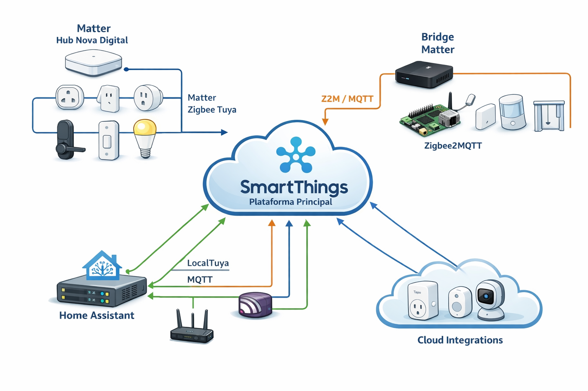

# Manifesto da Arquitetura de Casa Inteligente
**Plataforma principal: SmartThings**

Versão: **1.6**  
Status: **Vivo**  
Última atualização: **2026-01-04**

---

## 1. Propósito do Manifesto

Este documento define a **arquitetura alvo da casa inteligente**, estabelecendo princípios, decisões técnicas e **contratos arquiteturais** claros entre plataformas, hubs, integrações e interfaces (incluindo assistentes de voz).

Seus objetivos são:
- Garantir **estabilidade operacional**, especialmente após quedas de energia
- Evitar **duplicidade de controle** e estados inconsistentes
- Servir como **referência viva** para evolução futura
- Reduzir decisões improvisadas ao integrar novos dispositivos
- Governar explicitamente **interfaces de voz** para evitar múltiplas fontes da verdade e inconsistências recorrentes

Este manifesto **não** tem como objetivo:
- Centralizar toda a automação em uma única plataforma técnica
- Eliminar integrações cloud quando estas forem maduras e aceitáveis
- Padronizar marcas ou fabricantes específicos

---

## 2. Princípios Arquiteturais

1. **ST-first (SmartThings como plataforma principal)**  
   Sempre que existir uma integração nativa, estável e suportada pelo SmartThings, o dispositivo deve ser integrado diretamente ao ST.

2. **Single Source of Truth por dispositivo**  
   Cada dispositivo deve possuir apenas **um único dono operacional**, evitando controle simultâneo por múltiplas plataformas.

3. **Separação por natureza do dispositivo**  
   Atuadores (ação contínua) e sensores sleepy (evento pontual) possuem características operacionais distintas.

4. **Sensores sleepy não dependem de bridges cloud instáveis**  
   Sensores de porta, presença e cortinas a bateria devem evitar bridges conhecidas por instabilidade pós-reboot.

5. **Preferência por integrações locais ou edge para funções críticas**  
   Funções críticas (segurança, acesso, presença) devem priorizar integrações locais sempre que possível.

6. **Matter como padrão de interoperabilidade, não como obrigação universal**  
   Matter é adotado quando agrega interoperabilidade e estabilidade, não como requisito absoluto.

7. **Arquitetura resiliente a reboot e falhas de conectividade**  
   O ambiente deve se recuperar de forma previsível após quedas de energia ou rede.

8. **Assistentes de voz são interfaces, não plataformas**  
   Assistentes de voz (ex.: Alexa) **nunca** são considerados Source of Truth.

---

## 3. Visão Geral da Arquitetura

A arquitetura é organizada em **canais de integração convergindo no SmartThings**, respeitando o tipo de dispositivo, sua criticidade e comportamento operacional. A Alexa é tratada como **camada de interface de voz** (entrada de comandos), sem manter estado primário.

### Canais principais

1. **Matter via Hub Nova Digital**  
   Atuadores Zigbee Tuya (tomadas, interruptores, lâmpadas, fechaduras).

2. **Matter via Bridge (Zigbee2MQTT → MQTT → Bridge Matter)**  
   Sensores de porta, presença e cortinas a bateria.

3. **Integrações diretas no SmartThings**  
   - Dispositivos Matter over Wi-Fi  
   - Dispositivos não-Matter com integração nativa (ex.: Tapo)

4. **Integrações locais via Home Assistant**  
   LocalTuya, MQTT, observabilidade e suporte técnico.

5. **Interface de voz (Alexa)**  
   Entrada de comandos por voz integrada **somente** ao SmartThings.

> 📌 O SmartThings atua como **plataforma principal de automação**, enquanto o Home Assistant atua como **camada de integração local e suporte arquitetural**.  
> 📌 A Alexa atua como **interface**, delegando controle ao SmartThings.

---

### Diagrama da Arquitetura Atual

A figura abaixo representa a **arquitetura atual conforme este manifesto**, evidenciando:
- SmartThings como núcleo de orquestração
- diferentes canais de entrada (Matter, Bridge, integrações diretas)
- separação clara de responsabilidades (Source of Truth)

> Observação: a camada de voz (Alexa) deve ser entendida como **interface sobre o SmartThings**, evitando integrações paralelas diretas.

---

## 4. Contrato Arquitetural — Papéis das Plataformas

### 4.1 SmartThings — Contrato de Responsabilidade e Controle

O SmartThings é definido como a **plataforma principal de orquestração da casa inteligente**, responsável por automações, rotinas e experiência do usuário.

Entretanto, o SmartThings **não é necessariamente o controlador primário de todos os dispositivos**.

#### Regra de Ouro — Source of Truth

> **O SmartThings não deve parear, controlar ou manter o estado primário de dispositivos que já possuam outro sistema definido como “Source of Truth” (fonte de verdade).**

Um dispositivo possui **Source of Truth** quando existe outro sistema responsável por:
- pareamento inicial
- manutenção do estado do dispositivo
- reconciliação após falhas (reboot, queda de energia, perda de rede)
- envio de comandos diretos ao dispositivo

Nesses casos, o SmartThings atua **exclusivamente** como:
- consumidor de eventos
- orquestrador de automações
- camada de integração entre domínios
- ponto único de exposição para interfaces externas (ex.: Alexa)

#### Exemplos Práticos

| Dispositivo | Source of Truth | Papel do SmartThings |
|------------|----------------|----------------------|
| Sensor de porta Zigbee | Zigbee2MQTT | Consumir eventos |
| Sensor de presença | Zigbee2MQTT | Orquestrar automações |
| Cortina a bateria | Zigbee2MQTT | Orquestrar |
| Lâmpada Tuya Zigbee | Hub Nova Digital | Controlar via Matter |
| Tomada Tapo | SmartThings | Dono e controlador |
| Tuya Wi-Fi | LocalTuya (HA) | Consumidor opcional |

#### Ações Explicitamente Proibidas

O SmartThings **não deve**:
- Parear dispositivos Zigbee cujo Source of Truth seja o Zigbee2MQTT
- Controlar dispositivos já gerenciados por outro hub (Nova Digital, LocalTuya)
- Manter múltiplos caminhos de controle para o mesmo dispositivo
- Substituir o controlador primário definido neste contrato

Qualquer violação dessas regras é considerada **quebra arquitetural**.

#### Regra Mental de Validação

Antes de integrar um novo dispositivo ao SmartThings, deve-se responder:

> **“Quem é responsável por acordar, reconectar e reconciliar esse dispositivo após uma queda de energia?”**

Se a resposta **não for SmartThings**, então o SmartThings **não deve ser o Source of Truth** desse dispositivo.

---

### 4.2 Hub Nova Digital (Tuya)
- Bridge Zigbee → Matter para **atuadores**
- Fonte de verdade para atuadores Tuya Zigbee
- **Proibido** para sensores sleepy

### 4.3 Home Assistant (Supervised)
- Camada de integração local
- Hospeda Zigbee2MQTT, MQTT e LocalTuya
- Observabilidade e bridges especializadas
- **Não é** a plataforma principal de automação

### 4.4 Zigbee2MQTT
- Controle exclusivo de sensores sleepy e cortinas a bateria
- Fonte de verdade Zigbee para esses dispositivos

### 4.5 MQTT
- Backbone de eventos desacoplado

### 4.6 Bridge Matter
- Exposição de sensores Z2M/MQTT ao SmartThings
- Operação exclusiva em LAN com mDNS/multicast funcional

### 4.7 Alexa — Contrato de Interface de Voz

A Alexa é definida **exclusivamente** como **interface de entrada de comandos por voz**.

#### Regras obrigatórias
- Alexa **nunca** é Source of Truth
- Alexa **não** mantém estado primário confiável
- Alexa **não** deve descobrir/controlar dispositivos diretamente por múltiplos caminhos
- Alexa **não** deve manter skills concorrentes para o mesmo conjunto de dispositivos

#### Regra de integração
> **A Alexa deve se integrar exclusivamente ao SmartThings.**

Qualquer outro skill/caminho paralelo (Tuya, Tapo, HA, pareamento Zigbee no Echo, etc.) é considerado **violação arquitetural**.

---

## 5. Matriz de Decisão por Tipo de Dispositivo

| Tipo | Canal Preferencial | Observações |
|----|------------------|-------------|
| Tomadas | ST direto / Matter ND | Avaliar cloud vs local |
| Interruptores | Matter ND | Atuador contínuo |
| Lâmpadas | Matter ND | |
| Fechaduras | Matter ND | Dispositivo crítico |
| Sensores de porta | Z2M → MQTT → Bridge Matter | Sleepy |
| Sensores de presença | Z2M → MQTT → Bridge Matter | |
| Cortinas a bateria | Z2M → MQTT → Bridge Matter | |
| Tuya Wi-Fi | LocalTuya (HA) | Opcional expor ao ST |
| Tapo (exemplo) | ST direto | Integração cloud estável |

---

## 6. Catálogo de Integrações Diretas no SmartThings

### Objetivo do Capítulo

Este capítulo existe para **registrar conscientemente todas as integrações diretas** no SmartThings, fora dos fluxos padronizados (Matter via Hub / MQTT via Bridge), evitando perda de controle arquitetural.

Seu papel é:
- Tornar explícito o **estado real da arquitetura (as-is)**
- Evitar acúmulo de integrações diretas sem governança
- Permitir auditoria arquitetural ao longo do tempo
- Facilitar decisões futuras de migração/substituição/endurecimento

> 📌 **Regra:** todo dispositivo integrado diretamente no SmartThings **deve** estar listado aqui.

### Catálogo

| Fabricante | Tipo | Canal | Natureza | Observações |
|-----------|------|-------|----------|-------------|
| Tapo | Tomada | ST direto | Cloud | Estável |
| — | — | — | — | — |

---

## 7. Decisões Arquiteturais (ADR-lite)

- **ADR-01:** Sensores sleepy fora do Hub Nova Digital  
- **ADR-02:** MQTT como backbone de sensores  
- **ADR-03:** ST-first para integrações maduras  
- **ADR-04:** Alexa como interface, não como plataforma  

---

## 8. Runbook Operacional

### Ordem de boot pós-queda de energia
1. Roteador / Internet  
2. Home Assistant + MQTT  
3. Bridge Matter  
4. Hub Nova Digital  
5. SmartThings  
6. Alexa  

### Regras de ouro
- Nunca parear um dispositivo em dois hubs
- Nunca misturar sensores sleepy em bridges cloud instáveis
- Validar mDNS/multicast após alterações de rede
- Não habilitar múltiplas skills concorrentes na Alexa
- Expor dispositivos para Alexa **somente** via SmartThings

---

## 9. Checklist Oficial — Integração de Novo Dispositivo

### 9.1 Identificação
- [ ] Tipo do dispositivo (atuador / sensor / cortina / outro)
- [ ] Atuador ou sensor sleepy
- [ ] Alimentação (energia / bateria)
- [ ] Dispositivo crítico? (sim/não)

### 9.2 Integração nativa e estável no SmartThings?
- [ ] Sim → integrar direto no ST e registrar no Capítulo 6 (se aplicável)
- [ ] Não → continuar avaliação

### 9.3 Suporte a Matter?
- [ ] Sim → avaliar:
  - Hub Nova Digital (atuadores Tuya Zigbee via Matter)
  - ST direto (Matter over Wi-Fi)
- [ ] Não → continuar avaliação

### 9.4 Sensor sleepy ou a bateria?
- [ ] Sim → Z2M → MQTT → Bridge Matter
- [ ] Não → avaliar LocalTuya / integração local

### 9.5 Source of Truth (dono operacional)
- [ ] Dono definido (ST / Nova Digital / Z2M / LocalTuya)
- [ ] Garantido que não será pareado/controlado por outro hub

### 9.6 Classificação da integração (para decisões futuras)
- [ ] Local / Edge
- [ ] Cloud
- [ ] Dependência de internet aceita (sim/não)

### 9.7 Registro e rastreabilidade
- [ ] Atualizar Catálogo de Integrações Diretas (Cap. 6), se aplicável
- [ ] Atualizar diagrama, se necessário
- [ ] Registrar ADR-lite se decisão for excepcional

---

## 10. Runbook de Limpeza e Governança da Alexa

### Estado desejado
- **Apenas um skill ativo:** SmartThings
- Nenhum dispositivo descoberto diretamente por skills paralelas
- Nenhum Echo atuando como hub Zigbee para dispositivos da casa (evitar duplicidade)

### Procedimento recomendado (limpeza)
1. Desativar skills concorrentes (Tuya, Tapo, HA, etc.)
2. Remover dispositivos duplicados/órfãos na Alexa
3. Reativar apenas **SmartThings Skill**
4. Executar *Discover Devices*
5. Recriar Rooms/Groups somente com dispositivos provenientes do ST

---

## 11. Governança e Evolução

Este manifesto é um **documento vivo** e deve ser revisado:
- Após mudanças relevantes de infraestrutura (rede, hubs, bridges)
- Com a evolução do padrão Matter
- Quando falhas recorrentes indicarem desalinhamento arquitetural

Decisões que violem princípios ou contratos aqui definidos são consideradas **quebra arquitetural** e devem ser registradas.

---